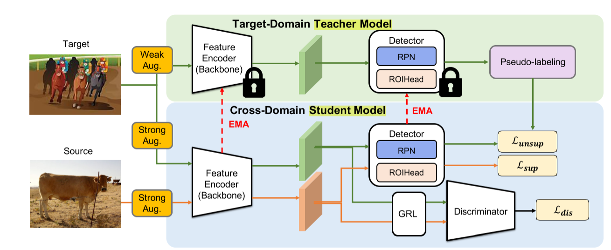

# Domain Adaptive Object Detection

### Motivation

**Object detection** suffer from domain shift where there is an obvious distribution gap between the pretraining data and the deployed environment. For example, an object detector trained on sunny day datasets may not perform well in a rainy scenario. To improve performance, collecting more rainy pictures might be cheap, while labeling them can be expansive!

To mitigate the performance drop caused by domain shift without extra annotation(i.e. collect a rainy day dataset), unsupervised **domain adaptation object detection(DAOD)** studies the tasks that the model is trained on a labeled source domain and an unlabeled target domain, and is expected to generalize well on the target domain. 

Given a **labeled source dataset** $D_s = {(x_s^i, y_s^i)}^{Ns}_{i=1}$ sized $N_s$ and an **unlabeled target dataset** $D_t = {x^i_t}^{Nt}_{i=1}$
sized $N_t$, where $x$ denotes an image and $y = (b, c)$ represents an annotation including bounding box $b$ and the corresponding category $c$, we train a domain adaptive detector with both $D_s$ and $D_t$, and evaluate the detection performance on data in $D_t$.

In this project, we aim to solve the DAOD task. For baseline detector, you can choose **YOLO** or **Deformable DETR** according to your GPU resources. For YOLO detector, you might need to modify this framework, which is built upon Deformable DETR. 

### Task 0: Preparation

#### Datasets

There are plenty of benchmarks in DAOD task. In this project, we encourage to use the **Cityscapes $\rightarrow$ Foggy Cityscapes** benchmark. Cityscapes is collected from urban scenes containing 2,975 images for training and 500 images for validation. Foggy Cityscapes is constructed by a fog synthesis algorithm from Cityscapes. We use Cityscapes as source domain and Foggy Cityscapes with highest fog density(0.02) as target domain. 

Other benchmarks such as **Cityscapes $\rightarrow$ BDD100k-daytime**, **Sim10k$\rightarrow$ Cityscapes(car only)**, **KITTI $\rightarrow$ Cityscapes** can also be used to evaluate your model.

Follow the `README.md` file to download datasets. You can also search online for backup if downloading from the original website is too slow.

#### Installation

Follow the `README.md` file to build the environment.

#### Training and evaluation

Follow the `README.md` file and modify the shell files in `configs` to run your code.

### Task 1: Source only Baseline

In this task, you are required to train a detector with only source domain dataset and evaluate it in target domain. This result can be considered as a **baseline** performance, to show how much your method can improve.

If you have limited GPU resources, you can choose YOLOv5[9] (or other version of YOLO) as your baseline detector. Github: https://github.com/ultralytics/yolov5.git

If you have enough GPU resources, you can choose Deformable DETR[1] for better performance. Github: https://github.com/fundamentalvision/Deformable-DETR.git

You should complete the following task:

- Read the paper of YOLO[9] or Deformable DETR[1]. Try to understand the method details.
- Read the code in Github.
- Complete the codes of model implementation. Dataloader codes have been provided in `datasets` and a framework of Deformable DETR is provided in `models`. You just need to copy the model code. 
- Train the model and report your results as a baseline.

### Task 2: Adversarial Feature Alignment

From the previous task, it was observed that a detector trained solely in the source domain may not perform well in the target domain. This discrepancy can be attributed to a domain gap between the two domains, meaning that the features extracted from images in each domain are significantly different. To address this issue, feature alignment can be employed to reduce the domain gap.

One approach to achieve feature alignment is through adversarial feature alignment, as proposed in DA-Faster[2]. This method is similar to Generative Adversarial Networks (GANs). It involves a Domain Classifier, which discriminates features belonging to the source or target domain. Additionally, a Gradient Reverse Layer is employed to encourage the model to confuse the classifier by feature alignment. The training objective can be defined as follows:
$$
L_{adv} = \max \, \min -\sum [D_i \log p_{i} + (1 - D_i) \log (1 - p_{i})]
$$
where $D_i$ denotes the domain label (i.e. $D_i=0$ for source domain and $D_i = 1$ for target domain), and $p_i$ denotes the probability that features belongs to this domain.

You should complete the following task:

- Modify the data loader to read source and target images at the same time.
- Feed images of both domain to the model.
- Apply adversarial feature alignment to features extracted from backbone and detection head.
- Try different alignment method and report your results. 

### Task 3: Teacher Student Framework

Teacher student framework is widely used in Knowledge Distillation(KD), and it is recently used in DADO task by AT[3]. 

A teacher model $T$ and a student model $S$ share the same structure of backbone, encoder and decoder. The teacher takes a weakly augmented target image $x_t$ and produces pseudo labels ( $b^t$, $c^t$). The student takes both source and target images which are strongly augmented. Supervised loss $L_sup$ is calculated on $x_s$ with their ground truth labels same as:
$$
\mathcal {L}_{sup} = \mathcal {L}_{box}^S(x_s, y_s) + \mathcal {L}_{giou}^S(x_s, y_s) + \mathcal {L}_{cls}^S(x_s, y_s)
$$
while $x_t$ receive supervision from pseudo labels, but only in classification task following as unsupervised loss:
$$
\mathcal {L}_{unsup} = \mathcal {L}_{cls}^S(x_t, \hat {b_t}, \hat {c_t})
$$
The teacher is only updated by **Exponential Moving Average (EMA)** from the student without gradient accumulation:
$$
\theta _t \leftarrow \alpha \theta _t + (1 - \alpha ) \theta _s
$$
where $θ_t$ and $θ_s$ denotes the model parameters of teacher and student respectively, and $α$ is a hyper-parameter.

You should complete the following task:

- Complete the EMA function and Teacher student framework.
- Train the student model with only source domain to warm up, and copy the warm-up weight to the teacher model. That's because teacher model requires a baseline performance to predict pseudo labels.
- Train the teacher student framework and report your results.

### Task 4: Bonus: Create your own Detector

Develop your own DAOD Detector by incorporating novel techniques to enhance existing implementation. Begin by reviewing some relevant papers (`[4, 5, 6, 7, 8, 9]`) on the DAOD task to gain insights. Look for modules or ideas that capture your interest and can potentially improve the performance of your approaches. Integrate these modules into your implementation to create an innovative DAOD Detector.

### Report & Presentation: 

Please write a detailed report summarizing all the efforts of your group and presenting all completed experiments. The report must clearly state the names and student IDs of the team members, along with the tasks assigned to each student. In the final stage, we will organize two class presentations, so please ensure that each group of students prepares early.
For more basic information, you can refer to the papers listed in the references and conduct internet searches. We encourage in-group discussion and independently complete tasks within the group.

#### Reference

[1] Xizhou Zhu, Weijie Su, Lewei Lu, Bin Li, Xiaogang Wang, and Jifeng Dai. Deformable detr: Deformable transformers for end-to-end object detection. In International Conference on Learning Representations, 2020.

[2] Yuhua Chen, Wen Li, Christos Sakaridis, Dengxin Dai, and Luc Van Gool. Domain adaptive faster r-cnn for object detection in the wild. In Proceedings ofthe IEEE conference on computer vision and pattern recognition, pages 3339–3348, 2018.

[3] Yu-Jhe Li, Xiaoliang Dai, Chih-Yao Ma, Yen-Cheng Liu, Kan Chen, Bichen Wu, Zijian He, Kris Kitani, and Peter Vajda. Cross-domain adaptive teacher for object detection. In Proceedings of the IEEE/CVF Conference on Computer Vision and Pattern Recognition, pages 7581–7590, 2022.

[4] Wen Wang, Yang Cao, Jing Zhang, Fengxiang He, ZhengJun Zha, Yonggang Wen, and Dacheng Tao. Exploring sequence feature alignment for domain adaptive detection transformers. In Proceedings of the 29th ACM International Conference on Multimedia, pages 1730–1738, 2021.

[5] Jinze Yu, Jiaming Liu, Xiaobao Wei, Haoyi Zhou, Yohei Nakata, Denis Gudovskiy, Tomoyuki Okuno, Jianxin Li, Kurt Keutzer, and Shanghang Zhang. Cross-domain object detection with mean-teacher transformer. arXiv preprint arXiv:2205.01643, 2022.

[6] Kaixiong Gong, Shuang Li, Shugang Li, Rui Zhang, Chi Harold Liu, and Qiang Chen. Improving transferability for domain adaptive detection transformers. arXiv preprint arXiv:2204.14195, 2022.

[7] Wei-Jie Huang, Yu-Lin Lu, Shih-Yao Lin, Yusheng Xie, and Yen-Yu Lin. Aqt: Adversarial query transformers for domain adaptive object detection. In 31st International Joint Conference on Artificial Intelligence, IJCAI 2022, pages 972–979. International Joint Conferences on Artificial Intelligence, 2022.

[8] Zijing Zhao, Sitong Wei, Qingchao Chen, Dehui Li, Yifan Yang, Yuxin Peng, Yang Liu. Masked retraining teacher-student framework for domain adaptive bbject detection, Proceedings of the IEEE/CVF International Conference on Computer Vision (ICCV), pages 19039-19049, 2023.

[9] Redmon J, Divvala S, Girshick R, et al. You only look once: Unified, real-time object detection[C]//Proceedings of the IEEE conference on computer vision and pattern recognition. 2016: 779-788.

